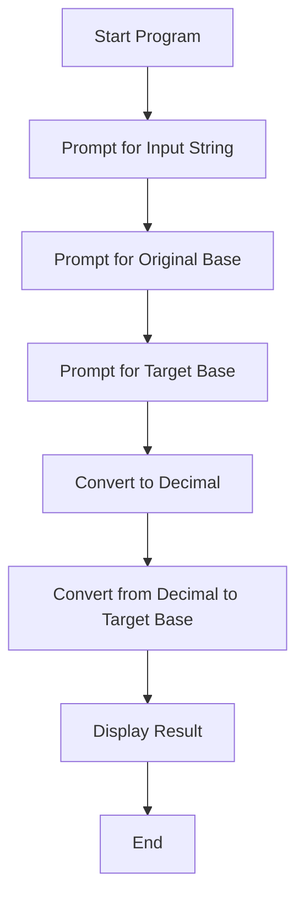

# The Hexorcist - Base Converter

Welcome to **The Hexorcist**, a simple Python program that converts numbers between bases ranging from 2 to 36. Whether you're working with binary, hexadecimal, or custom alphanumeric bases, this tool has you covered.

## How It Works

The program performs two main operations:

1. **to_decimal**: Converts a number string from its original base to base 10.
2. **from_decimal**: Converts a base 10 number to the target base.

## Features

- Supports bases from 2 to 36
- Handles alphanumeric digits (0–9, A–Z)
- Interactive command-line interface

## Getting Started

To run the program:

```bash
python3 hexorcist.py
```

